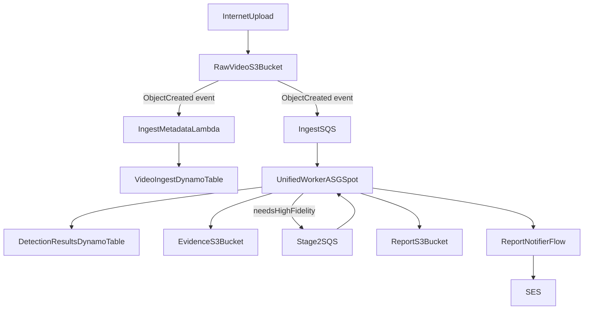

# onii-video-analytics

Pulumi Python infrastructure for a staged AWS video analytics platform on AWS.

This project creates the core infrastructure to ingest videos from the internet, process them quickly with a first analysis stage, reprocess uncertain cases with a more advanced second stage, store results, generate reports, and notify customers by email.

## Architecture Overview



## How It Works

1. A video file is uploaded to the raw video bucket.
2. S3 emits an `ObjectCreated` event to two consumers:
   - Ingest SQS queue for asynchronous processing by workers.
   - Metadata Lambda function that stores ingest metadata in DynamoDB.
3. A single spot-backed worker ASG reads from ingest and stage2 queues.
4. Worker executes initial analysis (fewer frames, 4 cameras, fast pass).
5. Worker writes identified products/people results to DynamoDB and stores artifacts in S3 evidence bucket.
6. If confidence is low or products are not fully identified, the same worker fleet enqueues an advanced pass request to Stage 2 SQS.
7. Worker executes advanced analysis (1080p, more frames, more cameras), updates final results, writes report artifacts to S3, and sends notification by SES.

## Provisioned AWS Components

- **S3**
  - Raw video bucket
  - Evidence bucket
  - Reports bucket
- **SQS**
  - Ingest queue + DLQ
  - Stage 2 queue + DLQ
- **DynamoDB**
  - Ingest metadata table
  - Detection results table
- **Auto Scaling**
  - Unified worker ASG (spot-backed)
  - Queue-depth-based scaling policies and CloudWatch alarms
- **Lambda**
  - Metadata writer Lambda for S3 ingest events
- **SES**
  - Sender identity for report notifications

## ASG Defaults Implemented

- min size: `0`
- max size: `3`
- scaling trigger: SQS queue depth (combined ingest + stage2)
- scale up behavior: increase capacity when message depth rises
- scale down behavior: reduce toward zero when queue remains idle
- default instance type: `g4dn.xlarge` (Spot)

## AMI Strategy (Recommended)

Use immutable AMIs for the worker ASG:

1. Build AMI in a separate image pipeline.
2. Publish resulting AMI ID to SSM Parameter Store (for example `/onii-video/dev/worker/ami-id`).
3. Pulumi reads the AMI ID from SSM and injects it into the launch template.
4. ASG rolls to the new image via instance refresh/update.

This project already supports:

- `workerAmiSsmParameter` (preferred)
- `workerAmiId` (manual override)

If neither is set, it falls back to a latest Amazon Linux 2 AMI lookup.

## CI/CD for AMI Creation

Yes, create a dedicated AWS pipeline for AMI baking:

- **CodePipeline**: orchestrates source -> build -> validate -> publish
- **CodeBuild**: runs Packer/Image Builder automation
- **Packer (or EC2 Image Builder)**: creates GPU-ready AMI
- **SSM Parameter Store**: stores promoted AMI ID consumed by Pulumi

CodeDeploy is optional and usually not required for AMI baking. Immutable AMI rollout through ASG is cleaner for this workload.

## Suggested Project Split

- **Infra repo (this repo)**: Pulumi, networking, queues, tables, buckets, ASG, IAM, Lambda wiring
- **Worker app repo**: video analysis code (YOLO, tracking, post-processing)
- **Image factory repo**: AMI build pipeline definitions and validation tests
- **(Optional) Lambda repo**: Lambda code if lifecycle differs from infra changes

This separation reduces blast radius and enables independent release cadence.

## YOLO Model Recommendation

Keep your initial choice:

- Initial pass: `YOLOv8n` on `g4dn.xlarge` spot
- Final pass: `YOLOv8m` on `g4dn.xlarge` spot
- Upgrade path: `g5.xlarge` for final-pass-heavy workloads when metrics justify

## Current Module Layout

- `__main__.py`: composition root and stack outputs
- `config.py`: typed Pulumi config loader
- `modules/storage.py`: S3 resources and secure defaults
- `modules/messaging.py`: SQS queues and DLQs
- `modules/database.py`: DynamoDB tables
- `modules/network.py`: VPC/subnet/worker security group wiring
- `modules/compute.py`: worker IAM + launch templates + ASGs
- `modules/events.py`: S3 notification wiring and metadata Lambda
- `modules/notifications.py`: SES identity
- `lambda_handlers/metadata_writer/metadata_handler.py`: Lambda handler code

## Configuration

Create/select the stack and set the required values:

```bash
pulumi stack init dev
pulumi config set aws:region us-east-1
pulumi config set onii-video-analytics:customerNotificationEmail you@example.com
```

Optional tuning:

```bash
pulumi config set onii-video-analytics:projectPrefix onii-video
pulumi config set onii-video-analytics:asgMinSize 0
pulumi config set onii-video-analytics:asgMaxSize 3
pulumi config set --path onii-video-analytics:instanceTypes[0] g4dn.xlarge
pulumi config set onii-video-analytics:workerAmiSsmParameter /onii-video/dev/worker/ami-id
# Optional manual override:
pulumi config set onii-video-analytics:workerAmiId ami-0123456789abcdef0
```

Per-bucket S3 versioning can be controlled in stack YAML with `bucketsConfig`:

```yaml
config:
  onii-video-analytics:buckets:
    - raw-videos
    - evidence
    - reports
  onii-video-analytics:bucketsConfig:
    raw-videos:
      enableVersioning: true
    evidence:
      enableVersioning: false
    reports:
      enableVersioning: true
```

Per-bucket lifecycle rules (expiration and storage class transitions) are also supported:

```yaml
config:
  onii-video-analytics:bucketsConfig:
    raw-videos:
      enableVersioning: true
      lifecycle:
        expireDays: 30
        abortMultipartDays: 3
        transitions:
          - days: 7
            storageClass: STANDARD_IA
          - days: 15
            storageClass: GLACIER
        noncurrentExpireDays: 14
        noncurrentTransitions:
          - days: 7
            storageClass: STANDARD_IA
        cleanDeleteMarkers: true
```

Standard governance tags can be supplied in stack config and are applied to taggable resources
(for example S3 buckets and SQS queues):

```yaml
config:
  onii-video-analytics:projectTags:
    Project: onii-video-analytics
    Environment: dev
    Owner: video-platform
    ManagedBy: pulumi
  onii-video-analytics:budgetTags:
    CostCenter: retail-ai
    BudgetOwner: finance
    BudgetScope: video-analytics
  onii-video-analytics:securityTags:
    DataClassification: confidential
    ComplianceRetention: short-lived
    SecurityTier: standard
```

## Deploy

```bash
python3 -m venv .venv
source .venv/bin/activate
pip install -r requirements.txt
pulumi up
```

## Notes

- SES requires sender email/domain verification in AWS.
- Worker bootstrap includes placeholders to pull analysis app artifacts.
- This version targets a single environment stack (`dev`) and can be extended later to `stage`/`prod`.